# DataTorrent Console (dtManage) Guide

The DataTorrent Console (aka dtManage) is a web-based user interface that allows you to monitor and manage the DataTorrent RTS platform and applications running on your Hadoop cluster.

To download the platform or the VM sandbox, go to [http://www.datatorrent.com/download](http://www.datatorrent.com/download).

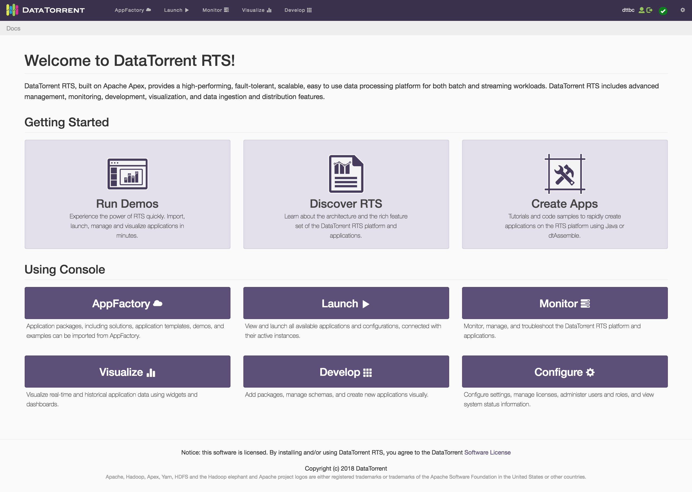

The Console includes the following features:

  * [AppFactory](#appfactory)
  * [Launch](#launch)
  * [Monitor](#monitor)
  * [Visualize](dtdashboard)
  * [Develop](#develop)
  * [Configure](#configure)

## AppFactory

The AppFactory hosts a collection of applications and templates grouped by various industries, that can be imported or downloaded (as .apa files). You can use the applications as they are, or use the templates as a starting point to develop custom applications.

## Launch

The Launch page lists all of the **Applications** and [**Configurations**](application_configurations.md) available for launching, as well as offering convenient management features.

Two alternative views are accessible through the **Applications** and **Configurations** buttons on the top right of the page. The **Applications** view lists all the applications across all the application packages. The **Configurations** view lists all the available application configurations.

The *instances* column lists all the running instances of each application or configuration. Clicking on an instance takes you to the application instance page.

### Uploading Packages and Configurations

To upload an application package (.apa), use the **upload package** button in the **Applications** view. To upload an application configuration (.apc), use the **upload configuration** button in the **Configurations** view.

### Launching Applications and Configurations

Applications and configurations can be launched using the **launch** button in the *actions* column. This opens a launch modal where you can confirm whether to **Launch** or **Configure** the application.

*Note*: Some applications and configurations must be configured before launching because they have incomplete required properties.

When using the **Configure** button in the *Launch Application* modal, a temporary configuration is used. Temporary configurations are useful for launching and testing quickly without creating extra configurations. Read more about [temporary configurations](/application_configurations#launching-quickly-with-temporary-configurations) on the main Application Configurations page.

#### Launch Dropdown

The dropdown menu to the right of the **launch** button contains some convenient management actions and alternative launch options.

When working with **Applications**, the dropdown provides quick access to related configurations, ability to launch with configuration xml files, and some package management actions.

When working with **Configurations**, the dropdown provides configuration management actions, links to related configurations, and source management actions.

#### Retargeting Multiple Configurations

Multiple configurations can have their source applications retargeted at the same time. This is useful when working with a new application version and you want to migrate a set of existing configurations.

To start, select all of the configurations you want to retarget using the selection checkboxes, then click the **retarget** button that shows up above the configurations list.

In the modal, select a new target source application, confirm your changes, and click **Retarget**.

## Visualize

See the [dtDashboard](dtdashboard) page.

## Monitor

The Monitor section of the Console can be used to monitor, troubleshoot, and manage running application instances.

### Cluster Overview

The operations home page shows overall cluster statistics as well as a list of running DataTorrent applications.

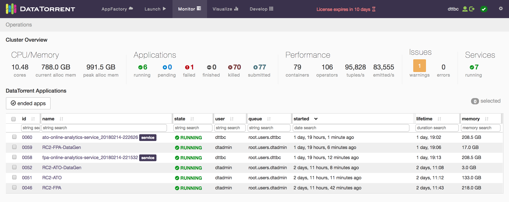

The CPU/Memory section shows the cpu cores and memory usage statistics.  The sample above shows that Apex applications are currently using `10.48 cores` and `788 GB` of memory, and that at one time memory usage peaked at `991.5 GB`.

The Applications section shows counts of all current application states.  The sample image shows there are `6 running` applications and `0 pending`.  It is important that the `pending` count does not continually show a value other than zero, which may indicate that the cluster lacks available cpu/memory resources to start a new application.

The Performance section shows current statistics such as container and operator counts, tuples processed per seconds and tuples emitted per seconds across all Apex applications.

The Issues section shows warning and error counts.  The count style changes to a clickable button if the value is nonzero.  Additional details about the errors and warnings may be viewed by clicking the error or warning count buttons, or by navigating to the [System Information](#system-information) section.

The Services section shows the current running/failed/stopped services.  Only states with nonzero values are shown.  The image above shows there are `7 running` services.

Below the cluster overview is a list of running applications.  In this list each column has a filter input just below the header which is useful for locating specific applications when there is a large number of applications running.  Clicking on individual column headers will sort the rows by that column value.  Clicking on a specific application id or name will take you to the instance page for that application (see below).

Selecting the **ended apps** button will include all ended applications that are still in the resource manager history.

Notice the **services** designation on the _ato-online-analytics-service_ and _fpa-online-analytics-service_ applications in the image above.  These are Apex applications running as services.  For more details on services, refer to the [Services](services.md) section.

### Instance Page

To get to an application instance page, click on either the app name or the app id in the list of running applications.

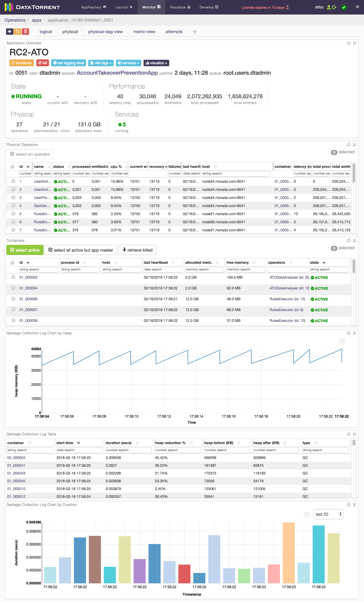

All sections and subsections of the instance page currently use a dashboard/widget system. The controls for this system are located near the top of the screen, below the breadcrumbs:

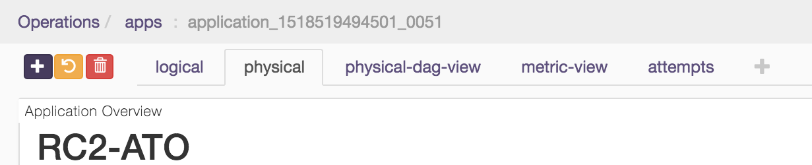

There are tool tips to help you understand how to work with dashboards and widgets. For most users, the default dashboard configurations (*logical*, *physical*, *physical-dag-view*, *metric-view*, *attempts*) will suffice. The following is a list of widgets available on an app instance page:

#### Application Overview Widget

All the default dashboard tabs have this widget. It contains basic information regarding the app plus a few controls. To end a running application, use either the “shutdown” or “kill” buttons in this widget:

The “shutdown” function tries to gracefully stop the application, while “kill” forces the application to end. In either case, you will need to confirm your action.

**Note**: You should not shutdown or kill an Apex application which is running as a service.  If you want to terminate such an application, then you should stop or delete the service.  For more details on stopping and deleting services, refer to the [Services](services.md) section. 

The **AM logs** button shows you a dropdown menu where you may find the App Master logs, application log and GC log.  Selecting one of the menu options will take you to the log page where you can analyze the logs.  See the [Viewing Logs](#viewing-logs) section for more details.

You can also use the **set logging level** button on this widget to specify what logging level gets written to the dt.log files. 

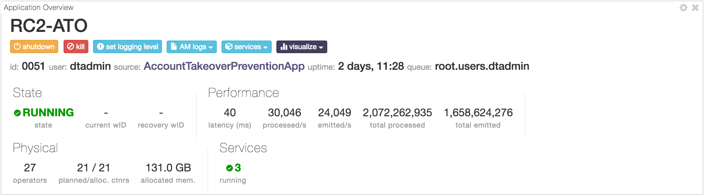

You will then be presented with a dialog where you can specify either fully-qualified class names or package identifiers with wildcards:

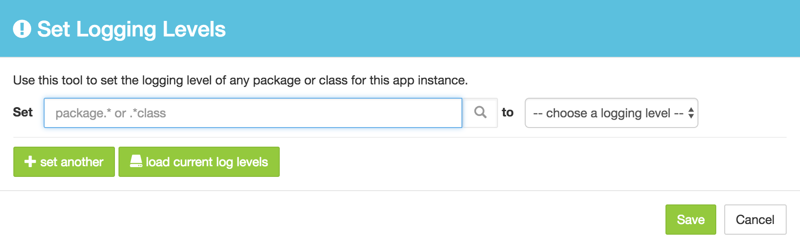

#### Stram Events Widget

Each application has a stream of notable events that can be viewed with the StrAM Events widget:

Some events have additional information attached to it, which can be viewed by clicking the "i" icon in the list:

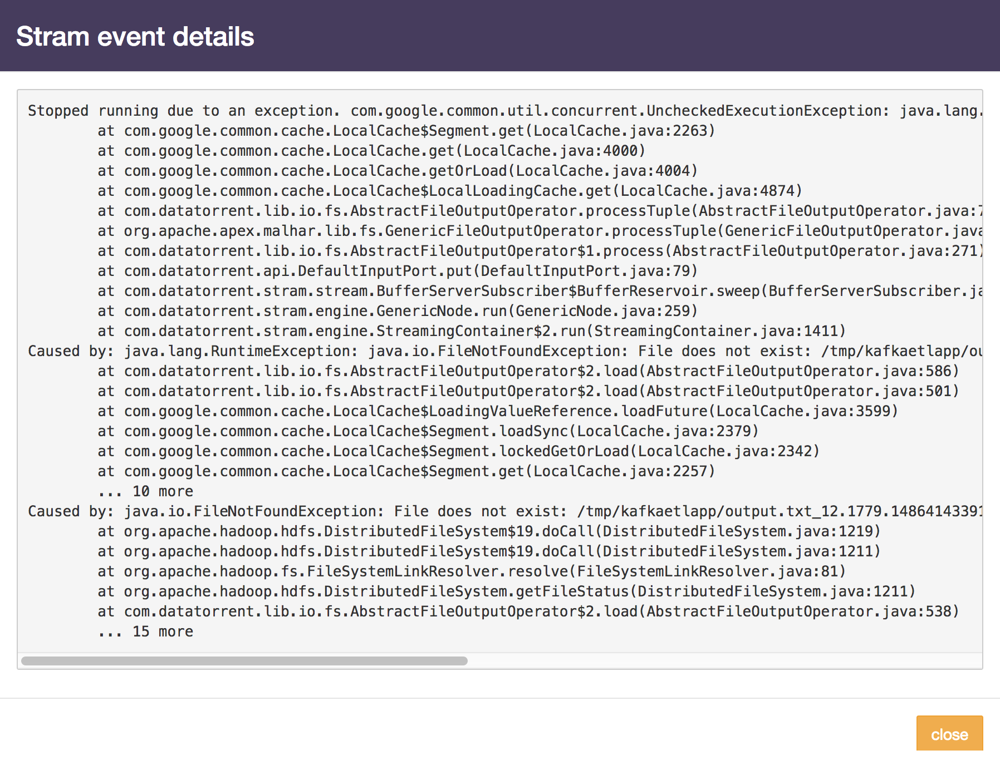

#### Logical DAG Widget

This widget visualizes the logical plan of the application being viewed:

Additionally, by selecting alternatives from the "Top" and "Bottom" dropdowns, you can cycle through
various metrics aggregated by the logical operators. In the screenshot above, processed tuples per
second and emitted tuples per second are shown.

The rectangle near the bottom right with a miniature representation of the DAG is a scrolling aid and
is useful when the DAG is very large and does not fit in its entirety in the browser window: You can
pan (i.e. shift the viewport) to a particular area of the DAG by moving the grey box with your pointer
to the corresponding area of the mini-DAG.

Clicking on the "Critical Path" checkbox, you can enable highlighting of the path of the longest
latencies highlighted in red:

Similarly, clicking on the "Stream Locality" checkbox will draw the streams with different dot patterns
to distinguish the different localities chosen.

>**Pro tip:** Hold the alt/option key while using your mouse scroll wheel to zoom in and out on the DAG.

#### Physical DAG Widget

This is similar to the Logical DAG Widget, except it shows the fully deployed "physical" operators. Depending on the partitioning of your application, this could be significantly more complex than the Logical DAG view.

Same-colored physical operators in this widget indicates that these operators are in the same container.

#### Logical Operators List Widget

This widget shows a list of logical operators in the application. This table, like others, has live updates, filtering, column ordering, stacked row sorting, and column resizing. 

One nice feature specific to this widget is the ability to set the logging level for the Java class of a logical operator by selecting it in this list and using the provided dropdown, like so:

#### Physical Operators List Widget

Shows the physical operators in the application and, for each operator, also shows the container
running it. The value in the "container" column is a clickable link which takes you to the page
for that container. The same link is also present in the "id" column of the "Containers" widget
described next.

#### Containers List Widget

Shows the containers in the application. Selecting a container by clicking on the checkbox
will trigger the display of additional buttons which allow you to retrieve logs, fetch info for
containers that have already terminated, retrieve a stack dump, or kill selected containers:

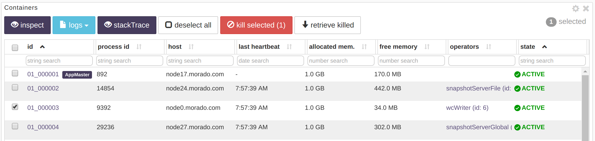

The Application Master container is the one whose container id ends with `_000001`.  The `AppMaster` label is shown to the right of the id, as shown in the above screenshot. The entries in the id column are clickable links that take you to the page for a specific container, showing the physical operators hosted in it and the relevant statistics:

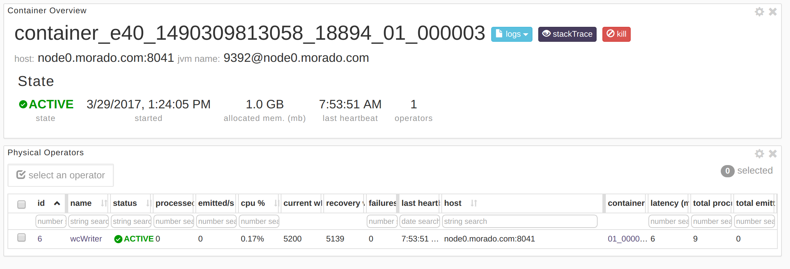

#### Logical Streams List Widget

Shows a list of the streams in the application. There are also links to the logical operator pages for the sources and sinks of each stream.

#### Metrics Chart

Shows various metrics of your application on a real-time line chart. Single-click a metric to toggle its visibility. Double-click a metric to toggle all other keys' visibility.

#### Garbage Collection (GC) Chart by Heap

This chart shows a container's heap memory in use in KB (kilo-bytes) against time. The chart is constructed by plotting and extrapolating in-use heap memory obtained from events in the GC log file of a container which requires GC logging to be enabled as described in [Application Configurations](/application_configurations#optional-properties). The chart shown is for a single container that is selectable from the radio buttons shown at the top right corner of the widget. Each container in the radio buttons and the chart is color-coded with the same color. The containers included depend on the context of the widget:

- all application containers in the application view
- all the containers containing the physical partitions of a logical operator in the logical operator view
- the single parent container of a physical operator in the physical operator view
- the container itself in the selected container view

#### Garbage Collection (GC) Log Table

This table shows the garbage collection (GC) events for a group of containers. This table too requires GC logging to be enabled as described in [Application Configurations](/application_configurations#optional-properties). The containers included in the group depend on the context of the widget:

- all application containers in the application view
- all the containers containing the physical partitions of a logical operator in the logical operator view
- the single parent container of a physical operator in the physical operator view
- the container itself in the selected container view

#### Garbage Collection (GC) Chart by Duration

This discrete bar chart shows GC event duration in seconds against time for a group of containers. Each bar is of fixed-width but the height denotes the duration of the corresponding GC event. This chart too requires GC logging to be enabled as described in [Application Configurations](/application_configurations#optional-properties). One or more containers are selectable from the radio buttons shown at the top right corner of the widget. Each container in the radio buttons and the chart is color-coded with the same color. The containers included depend on the context of the widget:

- all application containers in the application view
- all the containers containing the physical partitions of a logical operator in the logical operator view
- the single parent container of a physical operator in the physical operator view
- the container itself in the selected container view

### Recording and Viewing Sample Tuples

There is a mechanism called tuple recording that can be used to easily look at the content of tuples flowing through your application. To use this feature, select a physical operator from the Physical Operators List widget and click on the “record a sample” button. This will bring up a modal window which you can then use to traverse the sample and look at the actual content of the tuple (converted to a JSON structure):

>**Pro tip:** Select multiple tuples by holding down the shift key.

<a name="viewing-logs">
### Viewing Logs

Another useful feature of the Console is the ability to view container logs of a given application. To do this, select a container from the Containers List widget (default location of this widget is in the “physical” dashboard). Then click the logs dropdown and select the log you want to look at:

Once you are viewing a log file in the console, there are few tricks to traversing it. You can scroll to the top to fetch earlier content, scroll to the bottom for later content, "tail" the log to watch for real-time updates, grep for strings in the selected range or over the entire log, and click the “eye” icon to the far left of every line to go to that location of the log:

## Develop

Application packages and application configurations can be viewed and managed in the Develop section. For more information about application packages visit the [Application Packages Guide](http://docs.datatorrent.com/application_packages/).

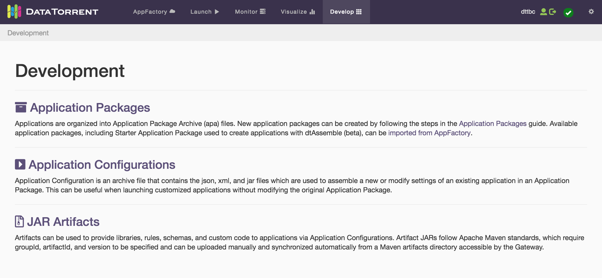

### Application Packages

To access the application package listing, click on the "Apps" link from the Develop Tab index page. From here, you can perform several operations directly on application packages:

- Download the app package
- Delete the app package
- Launch applications in the app package

> **Note:** If authentication is enabled, you may not be able to see others’ app packages, depending on your permissions.

### Application Package Page

Once you have uploaded or imported an App Package, clicking on the package name in the list will take you to the Application Package Page, where you can view all the package details.

Aside from various pieces of meta information (owner, DataTorrent version, required properties, etc), you will see a list of apps found in this package. 

### Viewing an Application

All DataTorrent applications are made up of operators that connect together via streams to form a Directed Acyclic Graph (DAG). To see a visualization of this DAG, click on the application name in the list of applications. In addition to the DAG, Package Properties and any Required Properties will be listed on this page.

## Configure

The RTS configuration menu is accessed by the cog button on the top-right corner of the Console. Under the **System Configuration** section, there are links to various tools to help you configure and troubleshoot your DataTorrent installation. The available menu items may differ depending on your security settings.

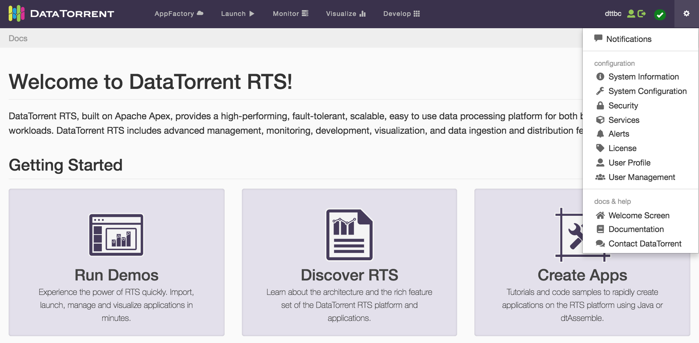

### System Information

This page displays details of the following:
* Gateway Information - Displays all the details of the gateway properties that are configured in the current DT RTS installation.
* Hadoop Information - Displays the details of Hadoop properties that are configured in the current DT RTS installation.
* Phone Home Information - Displays the data from the current DT RTS installation, such as usage statistics, which is dynamically aggregated over the time period of 24 hours and sent to the DT servers. The data is aggregated in total time frames that is it includes data from the start of the gateway installation to present.

### System Configuration

This page shows the system configuration, provides a way to make system changes, and displays any known issues for the DataTorrent RTS installation.

In addition, you can perform the following actions from this page:

  * SMTP Configuration - Set up SMTP to be able to send out email alerts and notifications.
  * Restart the Gateway - This button can be used to restart the gateway when the Hadoop configuration or system properties have changed.
  * Usage Reporting - If enabled, your DataTorrent installation will send various pieces of information such as bug reporting and usage statistics back to our servers.
  * Installation Wizard - Rerun the initial installation to reconfigure HDFS installation path and Hadoop executable.

### Security 

By default, your installation starts with no security enabled, which may be sufficient on a closed network with a limited set of users. However, it is recommended to use some form of authentication especially for production environments.

DataTorrent RTS supports various authentication methods which can be enabled by following instructions in the [Authentication](dtgateway_security/#authentication) section.

### Services
Services represent global, shared, and automatically managed processes. These processes are automatically installed, managed, and monitored by the Gateway, and can be an instance of an Apex application or a Docker container. Applications can rely on any number of services as their dependencies, and all the required services will be automatically installed and launched as needed when the application starts.  For more details refer to the [Services](services.md) section.

### Alerts

System alerts can be configured to notify users through the Console and emails based on various system and application metrics.

Click on the `+ create new alert` button to create an alert.

An alert consists of

 * a condition (a JavaScript expression)
 * a list of recipient email addresses
 * a threshold value in milliseconds
 * a message, and
 * an enabled/disabled flag

The gateway periodically (every 5 seconds) processes all enabled alerts by evaluating the condition. If the condition evaluates to `true`, the alert is said to be "in effect".
If the condition evaluates to `false`, the alert is said to be "out" (or "out of effect"). If the alert stays "in effect" for the duration specified as the threshold value,
then the alert is triggered and the gateway sends an "in effect" email message to all the recipient email addresses.

If a triggered alert goes "out of effect" then the gateway immediately sends an "out of effect" email message to all the recipient email addresses.

The alert condition is specified as a JavaScript expression which is evaluated in the context of something called `topics` which are described [here](dtgateway_systemalerts/#alerts-and-topics).

The gateway also provides pre-defined alert "templates" that allow a user to create alerts for certain common conditions without having to write JavaScript expressions.

Click on the "Predefined Conditions" tab and select a template from the drop-down list. Depending on your selection, you will need to provide more values to be filled into the template.
As an example, for the "Application Memory Usage" template you need to provide the Application Name and Memory values as shown below:

You can click on the "Javascript Code" tab to see the generated JavaScript expression that corresponds to your alert template selection and provided values as shown below:

You can generate a test email to validate your alert by checking the "Send Test Email" check-box and clicking on the blue "Test" button. The test email is sent regardless of the true or false result
of the JavaScript condition, if the evaluation has no errors provided SMTP is configured as described in the Alerts section.

### License 

Use the License Information page to view how much of your DataTorrent license capacity your cluster is consuming as well as what capabilities your license permits. You can also upload new license files here.

### User Profile

The User Profile page displays information about the current user, including their username, the authentication scheme being used, and the roles that the current user has. In addition, users can perform the following actions:

- Change password 
- Change the default home page
- Change the theme of the console
- Restore the default options of the console

### User Management

Use this page to manage users and their corresponding roles on your DataTorrent cluster. This page is accessible only to an admin user. You can do the following from this page:

*   Add users
*   Change users’ roles
*   Change users’ password
*   Delete users
*   Add roles
*   Edit role permissions
*   Delete roles

> **Note:** With most authentication schemes, the admin role cannot be deleted.

### Installation Wizard

The first time you open the Console, after installing DataTorrent RTS on your cluster, it will take you to the Installation Wizard. This walks you through the initial configuration of your DataTorrent installation, by confirming the following:

* Location of the Hadoop executable
* DFS location where all the DataTorrent files are stored
* Docker configuration
* DataTorrent license
* Summary and review of any remaining configuration items

At any time, you can go back to the installation wizard from the Configuration Tab. It can help diagnose issues and reconfigure your cluster and gateway.

When your Hadoop cluster has security enabled with Kerberos, there will be four additional controls in the installation wizard: 

- **Kerberos Principal**: The Kerberos principal (e.g. primary/instance@REALM) to use on behalf of the management console.
- **Kerberos Keytab**: The location (path) of the Kerberos keytab file to use on the gateway node's local file system.
- **YARN delegation token lifetime**: If the value of the `yarn.resourcemanager.delegation.token.max-lifetime` property in your cluster configuration has been changed from the default, enter it here. Otherwise, leave this blank and the default will be assumed.
- **Namenode delegation token lifetime**: If the value of the `dfs.namenode.delegation.token.max-lifetime` property in your cluster configuration has been changed from the default, enter it here. Otherwise, leave this blank and the default will be assumed.

> **Note:** The token lifetime values you enter will not actually set these values in your hadoop configuration, it is only meant to inform the DataTorrent platform of these values.

Docker configuration is optional.  For more details, refer to the [Docker Configuration](services.md#configuring-docker) section.
