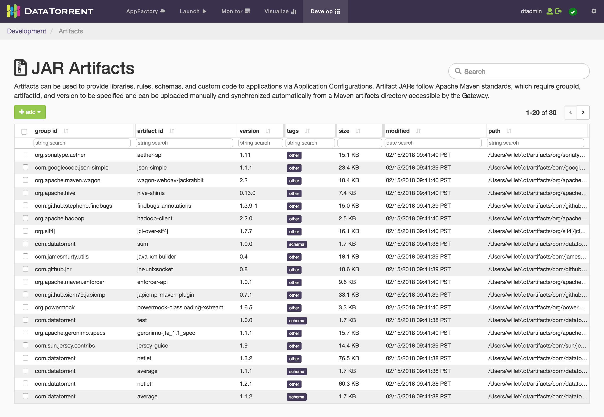
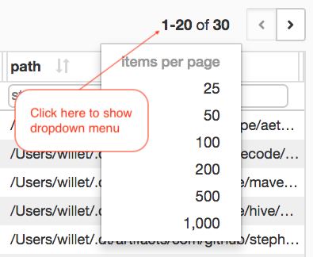
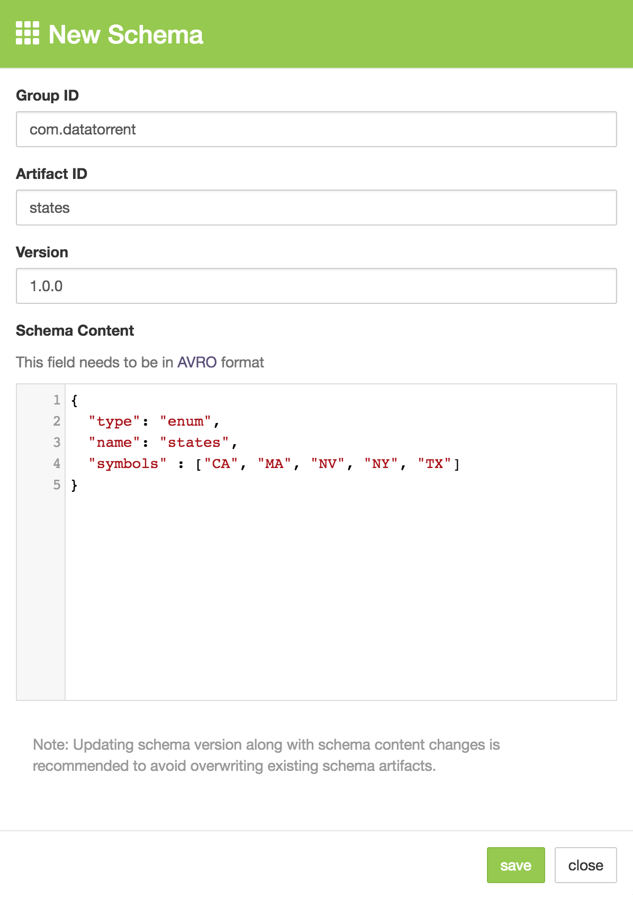
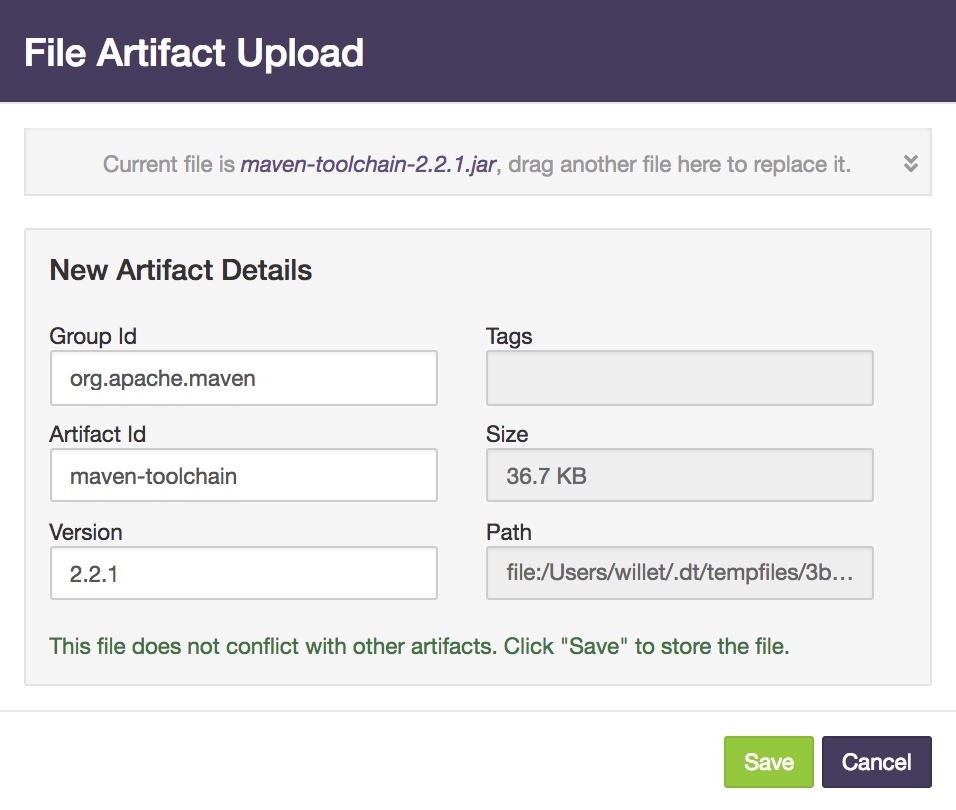

# JAR Artifacts

Artifacts can be used to provide libraries, rules, schemas, and custom code to applications.  JAR artifacts follow Apache Maven standards which require groupId, artifactId and version to be specified.  JAR files can be uploaded manually and synchronized automatically from a Maven artifacts directory accessible by the Gateway.  Users can also build new JAR files by creating new schemas using the **New Schema** dialog in the DT RTS Console.  Once the JAR artifacts are added to the DT RTS system, Apex applications can reference them in the [Application Configuration](application_configurations.md) page.

# Viewing Artifacts

Artifacts can be view and managed on the **JAR Artifacts** page in the DT RTS Console.  There you can create new schemas and upload JAR files.

To view the **JAR Artifacts** page, follow the steps below:

1. Click the **Develop** link on the top navigation menu.  The Development page is displayed.
2. Click the **JAR Artifacts** link on the Development page. The JAR Artifacts page is displayed.

Sample JAR artifacts list:



# Searching and Filtering

The search field in the upper right side of the page performs a global search across all the fields shown in the table.  Additionally, each column has its own filtering options where filter is performed on that field in addition to the global search and any other active filters.  Hovering over the filter input field displays the tooltip with examples of filter expressions which can be used for the specific filter.  As you enter the search string and column filters, the values are added to the URL parameters, making it possible to bookmark or share the filtered URL with another user.

# Setting Table Size and Pagination

By default, the table displays 20 artifacts per page.  However, you can change this by clicking on the artifacts count and selecting a different size.  
To the right of the artifact counts are the **previous** and **next** page buttons.  You can click on these buttons to navigate from page to page.  As the artifact offset value changes, the value is added to the URL parameters.  The parameter name for this value is `offset`.  If there are many artifacts in the system, you can type an offset number for the `offset` parameter to jump directly to that page.

Artifacts per page dropdown menu:



To change the artifacts per page, follow the steps below:

1. On the **JAR Artifacts** page, click the artifacts count above the artifacts table.  The dropdown menu is shown.
2. Select the desired _items per page_ menu item.  The list is refreshed with the selected count of artifacts per page. The selected artifacts per page should also be added to the URL parameters. This parameter name for this value is `limit`.

# Adding New Schemas

Existing schemas stored in JAR files can be uploaded by clicking **add** button and selecting **upload JAR** option.  Additionally, new schemas can be created by clicking **add** and selecting **new schema** option.  When new schemas are created from the UI, the Gateway packages the schema as a JAR file, and then stores it in the shared artifacts space on the DFS used by DT RTS.  The file names and directory structures follow the Maven directory layout and file naming standards.  New schemas can also be added on the [Application Configuration](application_configurations.md) page.

To create a new schema, follow the steps below:

1. On the **JAR Artifacts** page, click the **add** button.  A dropdown menu is shown.
2. Click on the **new schema** menu item.  The **New Schema** dialog is shown.

Sample of a new schema dialog:



The following entries are shown on the **New Schema** dialog:

| Item | Description |
| ---- | ----------- |
| Group ID | This is typically the organization name preceded by _org_ or _com_.  This value is also used as the top level directory where the JAR file is stored.<br/>For example: `org.apache.maven`, `com.datatorrent`, etc. |
| Artifact ID | A name representing this schema.  The schema is built and packaged as a JAR file and this value is used as part of the file name.<br/>For example: `netlet`, `java-xmlbuilder`, etc. |
| Version | The schema version.  The schema is built and packaged as a JAR file and this value is used as part of the file name.<br/>For example: `1.0.0`, `1.0.1`, etc.  |
| Schema Content | A JSON object structure representing the schema definition.  This JSON structure must comply with the [Apache Avro](http://avro.apache.org/docs/current/spec.html#schemas) specification.  You can click on the AVRO link on the dialog to open the Apache Avro schema documentation page in a new browser tab for reference. ``` {  "type": "enum",  "name": "states",  "symbols": ["CA", "MA", "NV", "NY", "TX"]}``` |

**Note**: If you enter the Group ID, Artifact ID and Version that match an existing schema or JAR artifact, you will see an error message stating that an artifact with the entered Group ID, Artifact ID and Version already exists.  The **Save** button will be disabled until you change one of the fields.

# Uploading JAR File

JAR files can be uploaded into the shared artifacts space on the DFS used by DT RTS.  When uploading JAR files, the Gateway searches for a pom.xml file in the JAR file to determine the `groupId`, `artifactId`, and `version` (GAV) for the JAR file.  If the JAR file does not have a pom.xml file, then users can enter the group ID, artifact ID and version in the upload dialog and save the JAR file.  If users have to enter the group ID, artifact ID and version, then the Gateway will create an pom.xml file containing this information and store it in the uploaded JAR file.

To upload a JAR file, follow the steps below:

1. On the **JAR Artifacts** page, click the **add** button.  A dropdown menu is shown.
2. Click on the **upload JAR** menu item.  The **File Artifact Upload** dialog is shown.
3. Drag a valid JAR file into the dialog.  The file is uploaded into a temporary storage for the Gateway to process the it.
4. If a valid JAR file is uploaded, then a JAR file upload form is shown.

    Sample JAR file upload dialog:

    

5. Enter the Group ID, Artifact ID and Version if necessary.
6. Click the **Save** button to save the JAR file to the shared artifacts space.

Below are the descriptions of the fields shown on the dialog:

| Item | Description |
| ---- | ----------- |
| Group ID |  This value is found in the `pom.xml` file inside the JAR file by the Gateway. If the pom.xml file is missing, then the value is empty.  You must enter an appropriate group ID in order to save the JAR file. This is usually the JAR artifact organization name preceded by _org_ or _com_.  This value is also used as the top level directory where the JAR file.<br/>For example: `org.apache.maven`, `com.datatorrent`, etc. |
| Artifact ID | This value is found in the `pom.xml` file inside the JAR file by the Gateway.  If the pom.xml file is missing, then the value is empty.  You must enter an appropriate artifact ID in order to save the JAR file.  This value is also used as part of the file name when saving the JAR file to the shared artifacts space.<br/>For example: `netlet`, `java-xmlbuilder`, etc. |
| Version | This value is found in the `pom.xml` file inside the JAR file by the Gateway.  If the pom.xml file is missing, then the value is empty.  You must enter an appropriate version in order to save the JAR file.  This value is also used as part of the file name when saving the JAR file to the shared artifacts space.<br/>For example: `1.0.0`, `1.0.1`, etc. |
| Tags | The Gateway analyzes the JAR file to determine the tags for the JAR file.  Possible tag values are: `rule` and `schema`.  If the Gateway cannot determine the tags for this JAR file, then an empty field is shown.  When saving the JAR file, the value `other` is saved with the JAR file. _This field is readonly_. |
| Size | The size of the JAR file. _This field is readonly_. |
| Path | The path and file name where the JAR file is temporary stored for processing. _This field is readonly_. |

After uploading a JAR file, the Gateway processes it and shows the information gathers from the JAR file.  You can process a different JAR file by dragging another JAR file into the top section of the dialog.  Alternatively, you can click on the down chevron button to expand that section and click on the **Choose another file** button.

If you are loading a JAR file that already exists in the shared artifacts space, you can overwrite the existing JAR file by clicking on the **Replace** button on the dialog.

# Synchronizing JAR Files

In addition to uploading JAR files and creating new schemas manually, Gateway can synchronize the jars from a Maven type `.m2` directory available to it on a local file system and copy these jars to shared artifacts space on the DFS.  This can be useful when automating build and delivery processes, or working with a [CEP Workbench Service](cep_workbench.md) where new artifacts are created and need to be made available to DT RTS automatically.  You must configure the `dt.gateway.maven.local.repo` property in the `dt-site.xml` file for this synchronization process to work.

To configure the Gateway to synchronize JAR files on the local file system with shared artifacts on DFS, follow the steps below:

1. Add the XML section below to the **dt-site.xml** file.

```xml
<property>
  <name>dt.gateway.maven.local.repo</name>  
  <value>/path/of/artifacts/store/on/the/local/fs/.m2</value>
</property>
```

2. Restart the Gateway.

Sample XML to configure JAR files synchronization:
```
<property>
  <name>dt.gateway.maven.local.repo</name>
  <value>/home/jenkins/.m2</value>
</property>
```

The example above designates the directory named `/home/jenkins/.m2` on the file system local to Gateway as the directory where all the Maven JAR artifacts are stored, and which will be synchronized with shared artifacts space on DFS used by DT RTS.
